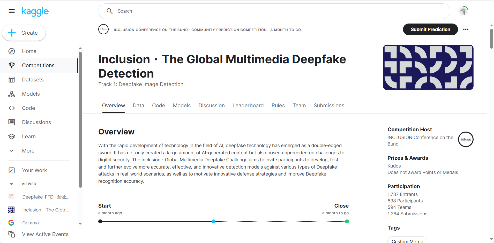
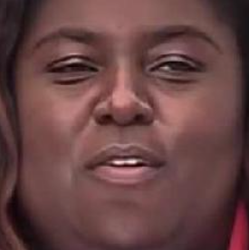
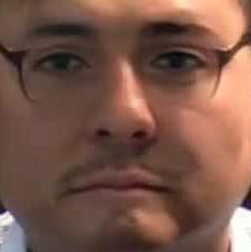
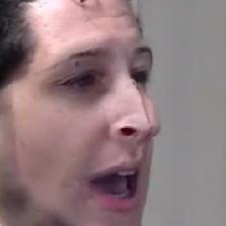
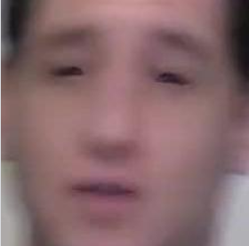
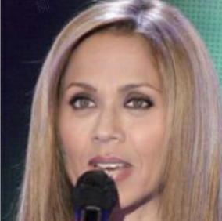
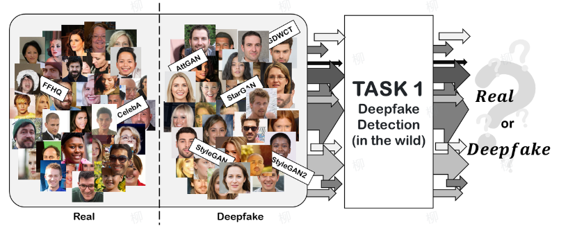
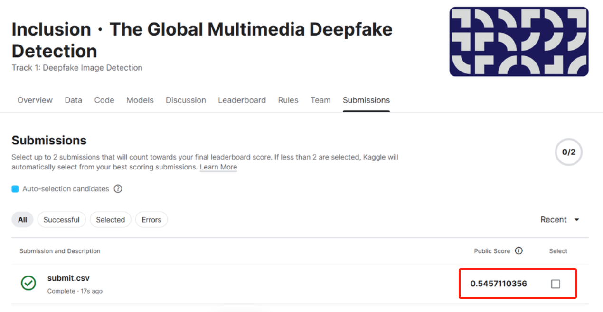

# 🔰从零入门CV图像竞赛(Deepfake攻防)

#AI夏令营 #Datawhale #夏令营

***



***

## 学习参考

比赛报名地址：[竞赛地址](https://www.kaggle.com/competitions/multi-ffdi)

学习参考：[学习手册](https://datawhaler.feishu.cn/wiki/Uou8w9igsibGP7kduiycCgesnOh)

<font color="blue">相关技术：</font>

>```markup
>  deepfake
>  python
>  pytorch
>  timm
>  pretrain
>```

## 第一章 赛题介绍

### Deepfake-FFDI-图像赛题

随着人工智能技术的迅猛发展，**深度伪造技术（Deepfake）**正成为数字世界中的一把双刃剑。这项技术不仅为创意内容的生成提供了新的可能性，同时也对数字安全构成了前所未有的挑战。Deepfake技术可以通过人工智能算法生成高度逼真的图像、视频和音频内容，这些内容看起来与真实的毫无二致。然而，这也意味着虚假信息、欺诈行为和隐私侵害等问题变得更加严重和复杂。

为了应对这一挑战，“外滩大会 - 全球Deepfake攻防挑战赛”旨在邀请全球的参与者开发、测试和改进更加准确、有效和创新的检测模型，以应对各种类型的Deepfake攻击。这些模型将在真实世界的场景中进行测试，从而推动创新防御策略的发展，提高Deepfake识别的准确性。

### 赛题任务

在这个赛道中，比赛任务是判断一张人脸图像是否为Deepfake图像，并输出其为Deepfake图像的概率评分。参赛者需要开发和优化检测模型，以应对多样化的Deepfake生成技术和复杂的应用场景，从而提升Deepfake图像检测的准确性和鲁棒性。

***

## 一、Task 1

任务一是**了解Deepfake赛题**。Deepfake是一种使用人工智能技术生成的伪造媒体，特别是视频和音频，它们看起来或听起来非常真实，但实际上是由计算机生成的。这种技术通常涉及到深度学习算法，特别是生成对抗网络（GANs），它们能够学习真实数据的特征，并生成新的、逼真的数据。通常如果想要**人工识别**虚假图像，可以通过以下四步：

* 首先可以**观察图像的细节**，是否有明显的不和谐，比如，眼睛或者嘴巴的不自然。
* 其次，检查**光线和阴影**，是否有与正常的光影效果存在差异。
* 再次，检查**像素**，放大图片中是否有模糊或者像素化的地方。
* 最后，检查**背景**，例如，图像的物品边缘是否平滑，背景是否有不自然现象。

例如下面几张图：



分别可以观察到**图像细节不自然**，**像素缺失**，**光影问题**，**背景异常**等问题。

`Task 1`的任务就是结合最近正火的**深度学习**技术，对数据集中的真/假图像进行辨别，如下图所示：



## 二、Task 2

任务二主要是**理解Baseline**包括代码以及设计思想。`深度学习`属于机器学习的一个分支，类似人脑神经元的工作模式，通过构建多层的神经网络，以此来学习复杂的信息。深度学习训练中可能会遇到各种各样的问题，具体可以参考我之前的这一篇笔记：[LiHongyi-2021-ML/notes/02、训练集调整.md at main · lyc686/LiHongyi-2021-ML (github.com)](https://github.com/lyc686/LiHongyi-2021-ML/blob/main/notes/02、训练集调整.md)。此外对于卷积神经网络相关的知识可以参考这一篇笔记：[LiHongyi-2021-ML/notes/03、Network网络架构.md at main · lyc686/LiHongyi-2021-ML (github.com)](https://github.com/lyc686/LiHongyi-2021-ML/blob/main/notes/03、Network网络架构.md)。

在深度学习中，有一个非常有效的策略称作**迁移学习**，迁移学习的目的就是基于大型数据集，首先进行训练，然后基于大数据集的结果，在同类型的小数据集下进行`微调`训练。通过这样的方法，可以使得模型较快的收敛以及取得更好的效果。

本次学习的`Baseline`使用的是resnet18的网络结构，可以通过`timm`库进行简单的使用。

```python
import timm
model = timm.create_model('resnet18', pretrained=True, num_classes=2)
model = model.cuda()
```

训练5轮之后的检测结果如下所示：



更多的尝试会在下面的任务学习中不断更新~

## 三、Task 3

任务三主要针对**数据增强**策略进行学习，以此来提升模型的效果。


